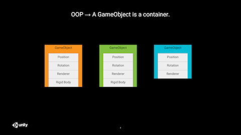
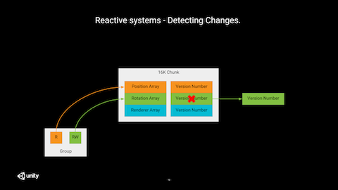

**Updates**  
2019-01-14: following @tertle suggestion on Unity forums, I removed the code sample using `GetComponentDataArray()`. This function gives the impression you're working with an array while it really is not the case. Its functionality should soon be plutoed. I also added a link to his [blog post](https://www.bovinelabs.com/ecs-hello-world/) about chunk iteration.  
2019-01-09: removed ComponentGroup injection example as injection is on its way out.
{:.message}

Just before the holiday season, we (at [Fishing Cactus](https://www.fishingcactus.com)) had the great pleasure to welcome our former colleague [Fabrice Lété](https://www.linkedin.com/in/letef/), now software engineer at Unity Technologies, for a talk in which he described what he and his team are currently working on: the brand new and shiny **Unity Entity-Component-System (ECS) framework**.

This blog post is a summary of the notes I took, *slightly* reordered and annotated with some code samples (copied from the official [ECS Samples repository](https://github.com/Unity-Technologies/EntityComponentSystemSamples/blob/master/Documentation/index.md)) to illustrate how these concepts translate into C#.


This talk was also given during Unite Los Angeles 2018 and the slides are available here: <https://docs.google.com/presentation/d/1vxE61D_N79cvgUI3eIocF2n4rn04wjgRRq00ugyoB1M/edit?usp=sharing>

* list
{:toc}

# Entity-Component-System

## ECS 101

Let's start with a quick recap of what ECS is and what advantages its brings with it.



Traditional (and often poorly written, see note below) OOP in video games sees entities as containers for components.
This often results in poor scaling with the number of entities because these components are often spread all over the memory, processed one by one, tightly coupled to each other and difficult to dispatch on multiple threads because of interdependencies.

Side note: this post is not a rant against OOP (there are enough forum wars on the topic all over the interwebs). I am convinced it is possible to write good performing OOP but I am also convinced it is hard and requires a lot of experience. ECS recipes on the other hand are super easy to learn and offer good performance by default.
{:.message}


Compared to this container approach, [ECS](https://en.wikipedia.org/wiki/Entity%E2%80%93component%E2%80%93system) is an architectural pattern which introduces the following concepts:
* an **entity** is just an id, which sole purpose is to group components logically together
* a **component** is just a store for data (a 'struct' without code logic)
* a **system** is responsible for processing / transforming the data stored in the components; to achieve this, it iterates over homogeneous groups of components.

Working with an ECS provides you with the following benefits:
* memory/cache-friendlier
    * only read from memory what you use (this is good for performance but also for power consumption if you target mobile platforms)
    * regular memory accesses help hardware prefetcher
    * tightly packed data makes better use of the cache
    * no extra padding
* opportunity to leverage multi core parallelism
    * thanks to clearly advertised dependencies between systems and no dependencies between components
* opportunity to auto vectorize code
    * thanks to working on groups of components at the same time

Source: <https://unity3d.com/learn/tutorials/topics/scripting/ecs-overview?playlist=17117>

These are the commonly advertised advantages of an ECS but I find another one also very interesting: the ability to reason with global knowledge about your entities. Instead of treating them one by one, you can apply optimizations that are only possible with a broader / more complete knowledge of your problem data (e.g. spatial partitioning, ...).

By writing your code for the ECS framework (vs traditional MonoBehaviors), you get all these benefits for free, without any added code complexity on the gameplay side; the complexity has been lifted off for you by the team behind the framework.
What's not to like about it? 😉

As a concluding note to this very quick introduction, it should be also be noted that ECS is only a part of a broader move from Unity to data oriented technologies regrouped under the DOTS acronym (for Data Oriented Tech Stack) which includes:
* ECS (of course)
* the [C# Job System](https://docs.unity3d.com/Manual/JobSystem.html)
* the [Burst compiler](https://docs.unity3d.com/Packages/com.unity.burst@0.2/manual/index.html)

## Deep dive

### Entities

An entity can be seen a super lightweight game object (it doesn't even contain a name); it is just an *id* allowing us to group components logically together. It is worth noting this id is persistent through the whole application lifetime, meaning it can be used to safely store a reference to another entity.

We haven't mentioned it yet but Unity ECS allows you to continue using existing GameObjects and MonoBehaviors, transitioning to the `ComponentSystem` style one step at a time. This is called *Hybrid ECS*. It doesn't come with all the benefits of vanilla ECS framework (mainly in terms of performance because of objects being scattered in memory) but thanks to it, you can already reap some of them (cleaner code thanks to a clear separation of data vs behavior, the ability to work on batch of components, a smooth transition to the new system, and you can continue to use existing inspectors as before).

In Hybrid ECS, you must add a `GameObjectEntity` to your `GameObject` so that an entity can automatically be created and registered to the `EntityManager` (when `GameObjectEntity.OnEnable()` is called). This `MonoBehavior` will also keep the link between the entity and the `GameObject`.

### Components

As described in the introduction, a component is a simple data store which contains no behavior, no code logic to transform its data.
It must be a `struct` implementing the `IComponentData` interface; it is thus a [value type](https://docs.microsoft.com/en-us/dotnet/csharp/language-reference/keywords/value-types) allowing it to live in non managed memory.

Examples of components are `Position`, `Rotation`, ...

```c#
public struct Position : IComponentData
{
    public float3 Value;
}

public struct Rotation : IComponentData
{
    public quaternion Value;
}
```

You'll notice these types don't use the regular `Vector3` or `Quaternion` classes you're used to see in Unity.
`float3` and `quaternion` are part of the [Unity.Mathematics](https://github.com/Unity-Technologies/Unity.Mathematics) library which provides a math library whose API will look familiar to anyone who's done some HLSL programming in the past. The [Burst compiler](https://docs.unity3d.com/Packages/com.unity.burst@0.2/manual/index.html) is aware of these types and can generate highly optimized SIMD native code for these types.

In Hybrid ECS, you might also want to add a `ComponentDataWrapper` so that they can be used from within the editor. If you plan on using them from code only, that's not necessary.

```c#
[Serializable]
public struct RotationSpeed : IComponentData
{
    public float Value;
}

public class RotationSpeedComponent : ComponentDataWrapper<RotationSpeed> { }
```

### Archetypes

Archetypes are at the very core of Unity's ECS implementation.
They are responsible for storing and organizing the components so that systems can query and work on those in the most efficient way.


Entity/component frameworks find their roots in the application of the [*composition over inheritance*](https://en.wikipedia.org/wiki/Composition_over_inheritance) principle; in Unity ECS, this composition finds its realization at the archetypes level.

An archetype is a unique set of arrays, each array being used to store one (and one only) type of component.
All these arrays are ordered so that all components at a given index correspond to the same entity; and so, all entities stored in a given archetype share the exact same set of components.
By storing the components in contiguous homogeneous arrays, the systems can iterate on them very efficiently, leveraging the hardware prefetcher to its fullest potential.

This has a very important implication: each time the structure of an entity is modified (i.e. each time we add or remove a component to an entity), it must be memmoved to another archetype. This has a cost, especially if doing this on lots of entities very frequently. Take this fact into consideration when designing your code.
{:.message}

You can create an archetype and instantiate an entity in code like this:

```c#
EntityArchetype archetype = EntityManager.CreateArchetype(
    typeof(Position),
    typeof(Rotation),
    typeof(LinearMovement));

var entity = EntityManager.CreateEntity(archetype);
```

Or you can let the framework manage these archetypes automatically for you by instantiating prefabs (see *Hybrid ECS*).

The framework will also be responsible for moving entities between archetypes when components are added or removed to them.

#### Chunks

We just said that archetypes are made of arrays... that was a lie.


The fact that an array operates on a single contiguous block of memory is highly interesting but comes with some downsides.

First, deleting an item inside an array requires moving all the following items one position back (or require extra bookkeeping to know which indices should be treated as empty).
However, it is worth noting that systems do not (and should not) care about the order of the entities stored in these arrays.
So we can use a well known trick which consists in replacing the deleted item by the last one of the container, saving a full move of the items behind it at the cost of losing the original order.

Second, and this one is much more problematic, insertion (even at the end) can be very costly.
Indeed, when the reserved capacity is exhausted, the system needs to allocate a bigger buffer and *memmove* all previous items to this new buffer.

In order to alleviate this last issue, archetypes are not working with arrays but with linked lists of 16KB chunks, each of these chunk containing arrays for the different types of components.
This provides a good tradeoff; insertion never requires a full copy of all existing items and we still retain good cache coherency inside chunks.

### Systems


Systems transform data. They implement the logic that modifies the components.

It is important to notice that for lots of actions, you don't care about the specific type of an entity; what you care about is specific properties of these entities.
E.g. for rendering all you need is a mesh and a transform matrix; you don't care if the entity is a player or a tree.

In order to do so, systems have to declare what components they operate on by performing queries; let's meet the *Groups*.

#### Groups

Systems do not work on archetypes immediately. It would be tedious to declare the exhaustive list of archetypes to work with. Instead, systems describe their requirements as groups; each group being a query on archetypes which returns the matching components (from possibly multiple archetypes) under a unified view.


In the picture above, the system shown will operate on 2 groups.

Sample code illustrating how to declare and use a `ComponentGroup` to iterate over chunks:

```c#
class PositionToRigidbodySystem : ComponentSystem
{
    ComponentGroup m_Group;

    protected override void OnCreateManager(int capacity)
    {
        m_Group = GetComponentGroup(new EntityArchetypeQuery
        {
            All = new[] {
                ComponentType.Create<Position>(),
                ComponentType.Create<RigidBody>()
                }
        });
    }

    protected override void OnUpdate()
    {
        var positionTypeReadOnly = GetArchetypeChunkComponentType<Position>(true);
        var rigidbodyTypeRW = GetArchetypeChunkComponentType<Rigidbody>();

        NativeArray<ArchetypeChunk> chunks =
            m_Group.CreateArchetypeChunkArray(Allocator.TempJob);

        for (var chunkIndex = 0; chunkIndex < chunks.Length; chunkIndex++)
        {
            ArchetypeChunk chunk = chunks[chunkIndex];
            NativeArray<Position> rotations = chunk.GetNativeArray(positionTypeReadOnly);
            NativeArray<Rigidbody> rigidbodies = chunk.GetNativeArray(rigidbodyTypeRW);

            for (var i = 0; i < chunk.Count; i++)
            {
                rigidbodies[i].position = positions[i].Value;
            }
        }

        chunks.Dispose();
    }
}
```

#### Subtractive components & tags components


Sometimes, you want to specifically exclude some archetypes based on the presence of some component (e.g. a damage system doesn't need to process entities that have an invincibility component whatever other components they possess).
Subtractive components are meant to exactly solve this; they allow to exclude some archetypes from a query by specifying which components must not be part of the result set.

On top of this, filtering can be further refined thanks to the use of empty components (AKA tag components) whose sole purpose is to help making more precise queries (e.g. boid targets in the [boid demo](https://github.com/Unity-Technologies/EntityComponentSystemSamples/blob/master/Samples/Assets/GameCode/Samples.Boids/BoidTargetComponent.cs)).

```c#
namespace Samples.Boids
{
    [Serializable]
    public struct BoidTarget : IComponentData { }

    [UnityEngine.DisallowMultipleComponent]
    public class BoidTargetComponent : ComponentDataWrapper<BoidTarget> { }
}
```

#### Shared Components


Maintaining a strict order for the entities would be costly and not necessarily desirable or helpful.
However some form of grouping can be beneficial when entities share some values and could benefit from this sharing (memory-wise or for performance reasons). For example, grouping entities which share the same mesh and material can help the renderer perform more optimally by batching draw calls dynamically.

Shared components to the rescue!

Whenever you add a shared component to an entity, entities will be grouped per chunk, so that all entities in a given chunk share the same value for this shared component.


Since all entities in a given chunk share the same value, it is not necessary to store the component once per entity; it can be stored once per chunk (to be more correct, the chunk stores the index to the `SharedComponentData`, so multiple chunks can point to the same data).

A corollary from this is that shared component values shouldn't change often, as they would require to memmove all the component data from the changed entities to another chunk.
{:.message}

It is also worth noting that a chunk can store multiple shared components.

Be cautious when using multiple shared components as this might lead to poor occupancy of the chunks (and thus waste of memory) if not done carefully enough (because each combination of shared component values will end up in a different chunk). The entity debugger can help you spot this kind of problem.
{:.message}

Try to also restrain yourself to component values which can result in some meaningful grouping; do not use position as a shared component ;p

Here is a nice example of shared component with the `MeshInstanceRenderer`.

```c#
public struct MeshInstanceRenderer : ISharedComponentData
{
    public Mesh                 mesh;
    public Material             material;

    public ShadowCastingMode    castShadows;
    public bool                 receiveShadows;
}
```

### Worlds


Worlds are for isolation.
Each `World` contains an `EntityManager` and a set of `ComponentSystems`.
Systems, entities and archetypes from one world are not available to another one.

Typically, you would use one `World` for simulation and another one for rendering.

In the [Megacity demo](https://www.youtube.com/watch?v=j4rWfPyf-hk), worlds are used for streaming. Once a new world is ready, it is merged quickly (less than 0.5ms on the target hardware for this demo) with the one being active and rendered.

## Reactive systems

Sometimes, it is desirable to know when an entity is seen for the first time by a system, for example to perform an initial setup.
Similarly, it can be interesting to know when an entity leaves the group of entities seen by the same system to perform some cleanup.
Finally, a system can also be interested in knowing when changes to a component value occurred.

*Where there is one, there are many.*
This is true for regular updates but it's also true for these (possibly) less frequent events.
So, something we would like to avoid is having a callback being invoked whenever a component is added to or removed from an entity, and even less whenever a component value has been updated.

Let's start by seeing how we can detect new and deleted entities from the system point of view.

### Detecting new and deleted entities

One solution would be to scan the whole list of entities and compare it against the one from the previous update.
Needless to say that this can be quite costly and there must be a better way.

An alternative solution would be to leverage [tag components](#subtractive-components--tags-components) to detect these new entities.
All you would have to do, is to add a tag component when an entity changes its state to be processed by a new system and remove that component once it's been processed the first time.
However, this is not ideal and error prone as you would have to know which tag component to add.
It would also be difficult to detect entity removals with this technique.

The better way has a name: [**System State Components**](https://github.com/Unity-Technologies/EntityComponentSystemSamples/blob/master/Documentation/reference/system_state_components.md) (SSC).
In code, these components implement the `ISystemStateComponentData` interface instead of `IComponentData`.
These components are just like regular components but their lifetime rules are different.
When an entity is destroyed, all its components are destroyed, except the system state ones.

This simple property changes a lot to the game and allows for easy detection of additions and deletions.

Let's take the example of the [`TransformSystem`](<https://github.com/Unity-Technologies/EntityComponentSystemSamples/blob/master/Documentation/reference/transform_system.md>).
It's role is to update the local-to-world transformation matrices used by other systems.
It operates on all entities that have at least one of the following components: `Position`, `Rotation` and/or `Scale`.
And it combines the values of these components in a `LocalToWorld` system state component.

```c#
    public struct LocalToWorld : ISystemStateComponentData
    {
        public float4x4 Value;
    }
```


Now, let's check the different cases which can occur:
- `Position`/`Rotation`/`Scale` exist and `LocalToWorld` does not => this is a new entity. `TransformSystem` can do whatever initial setup is required for this entity, then add the `LocalToWorld` component to it.
- `Position`/`Rotation`/`Scale` exist and `LocalToWorld` exists too => this is a tracked entity. Nothing special to be done.
- `Position`/`Rotation`/`Scale` don't exist and `LocalToWorld` exists => this is a deleted entity (by some other system). `TransformSystem` can do its internal cleanup and remove the system state component itself.

### Detecting changes



System State Components do solve the addition/deletion detection problem nicely.
But what about tracking changes to component values?

The ECS framework can't provide us with per entity detection as this would require a lot of bookkeeping, without being more efficient than what you could do at the system level.
However, what they offer, is per chunk indication of possible changes. What does that mean?

Within each chunk, each array comes with a version number. Read-only arrays version numbers are not modified when they are accessed; however, when a read-write array is accessed by a system, its version number is assigned to the `EntityManager.GlobalSystemVersion`.

Thanks to these version numbers, when we [manually iterate over chunks](https://github.com/Unity-Technologies/EntityComponentSystemSamples/blob/master/Documentation/reference/chunk_iteration.md), we can now determine if some component values have (potentially) been modified (with chunk granularity).

```c#
var chunkRotationsChanged = ChangeVersionUtility.DidAddOrChange(
    chunk.GetComponentVersion(rotationType),
    lastSystemVersion);
```

# Job component system vs component system

While already a good step towards better performing games, the ECS is only one part of the DOTS.


Regular component systems run on the main thread, and add up to everything already sitting on this busy thread.
This does not make good use of the ever increasing number of cores in your processor which are sitting idle.

Component Systems (CS) can work hand in hand with Unity C# job system: please welcome the Job Component Systems (JCS).


JCS do run on the main thread but they appear much shorter than their CS counterparts; that's because all they do, is schedule jobs to be performed on worker threads.

The scheduler is smart enough to prevent race conditions. As long as the component arrays are accessed as read-only, jobs from different systems can be processed in parallel. As soon as one of the jobs is writing to some data then it can't be run in parallel to one accessing the same data (be it in read-only or read-write mode); these jobs are scheduled with a dependency between them.

As we said before, order within a group is not important; this allows for another nice optimization.
A system update can now see its work being sliced and dispatched on multiple worker threads. Yeah!


Extreme caution should be observed when mixing CS and JCS: all structural changes have hard sync points (e.g. entity creation/destruction, component addition/removal, ...). This means that whenever one of these events occur (on the main thread), all jobs scheduled by JCS will have to be completed before performing that change, resulting in a huge stall.

Stick with Job Component Systems and do not mix them with Component Systems (unless you know what you're doing).
{:.message}

```c#
public class RotationSpeedSystem : JobComponentSystem
{
    [BurstCompile]
    struct RotationSpeedRotation : IJobProcessComponentData<Rotation, RotationSpeed>
    {
        public float dt;

        public void Execute(ref Rotation rotation, [ReadOnly]ref RotationSpeed speed)
        {
            rotation.Value = math.mul(
                math.normalize(rotation.Value),
                quaternion.axisAngle(math.up(), speed.Value * dt));
        }
    }

    protected override JobHandle OnUpdate(JobHandle inputDeps)
    {
        var job = new RotationSpeedRotation() { dt = Time.deltaTime };
        return job.Schedule(this, 64, inputDeps);
    }
}
```

Please note it is also possible to iterate over chunks in jobs using `IJobChunk`.
A good example can be found [here](https://www.bovinelabs.com/ecs-hello-world/).

# THE END

That's it for today. I hope you did learn a thing or 2 and that you enjoyed this post as much as I enjoyed attending this talk.

I would like to address a double round of thanks to Fabrice; one for giving us this presentation during his holidays  back in Belgium, and another one for reviewing these notes before I published them.

I also would like to tank [Pieter Vantorre](http://pietervantorre.com/) for proofreading this article and spotting a silly mistake I made.

If you have any question and/or any feedback (or just want to say hi), please do not hesitate to write a comment below or to contact me on twitter [@Rams3s](https://twitter.com/Rams3s).

# Further reading

- <https://github.com/Unity-Technologies/EntityComponentSystemSamples/blob/master/Documentation/index.md>
- <https://www.bovinelabs.com/ecs-hello-world/>

<!--
# Questions for Fabrice

* Serait-il possible de publier la présentation afin
* Un lien vers http://www.drealmer.net/? LinkedIn?
* Value type for component data, is it ok?
* Any way to make reference objects contiguous in memory?
-->