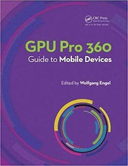

Delva, Michael, Julien Hamaide, and Ramses Ladlani, "Semantic Based Shader Generation Using Shader Shaker," in Wolfgang Engel, ed., GPU Pro6, CRC Press, pp. 505-520, 2015. 

Ladlani, Ramses, "Tiled Deferred Blending," in Wolfgang Engel, ed., GPU Pro5, CRC Press, pp. 297-312, 2014. 
also in Engel, Wolfgang, GPU Pro 360 Guide to Mobile Devices. New York: A K Peters/CRC Press, pp.121-136, 2018.

