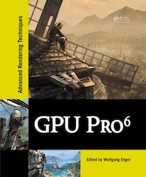
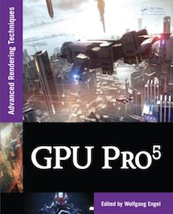

Semantic Based Shader Generation Using Shader Shaker, Michael Delva, Julien Hamaide, and Ramses Ladlani, 2015, in [GPU Pro 6](https://www.crcpress.com/GPU-Pro-6-Advanced-Rendering-Techniques/Engel/p/book/9781482264616)

Tiled Deferred Blending, Ramses Ladlani, 2014, in [GPU Pro 5](https://www.crcpress.com/GPU-Pro-5-Advanced-Rendering-Techniques/Engel/p/book/9781482208634)

